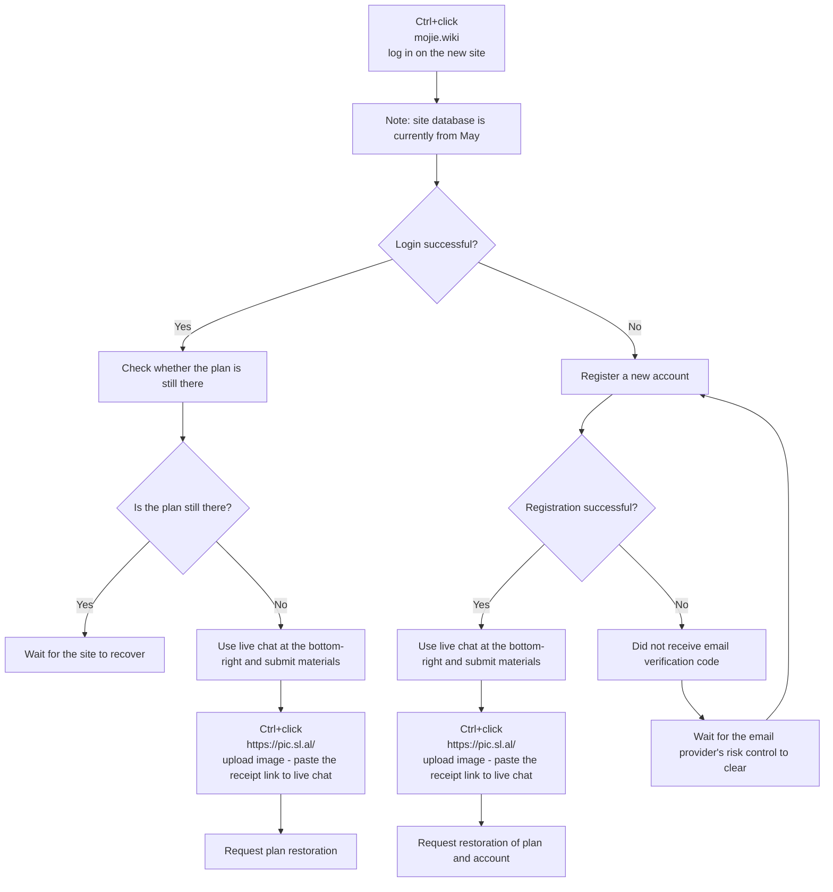

🇨🇳 [中文](README.md) | 🇺🇸 English | 🇷🇺 [Русский](README_RU.md) | 🇮🇷 [فارسی](README_FA.md)

# Mojie (Magic Ring) Official Addresses (Updated September 21, 2026)

Mojie official website addresses  
Redirect address 01: [www.mojie.wiki](https://www.mojie.wiki)  
Latest address 02: [www.kateyun.org](https://www.kateyun.org)  
Official address: [mojie.wiki](https://mojie.wiki)  
Permanent address: [kateyun.org](https://kateyun.org)

2026 recommended VPN / proxy services and node sharing: [https://github.com/modporbme/Global-VPN-SpeedUp](https://github.com/modporbme/Global-VPN-SpeedUp)

## Telegram VPN Community #AD
[Giveaway group](https://t.me/kateyun_org) | [Chat group](https://t.me/kateyun_org) | [Trial group](https://t.me/kateyun_org)

## Introduction
“Mojie” is a professional network-path optimization service with 86 ~~global points of presence, including [US residential](https://github.com/modporbme/mojie#1%E7%BE%8E%E5%9B%BD), [Hong Kong residential](https://github.com/modporbme/mojie#2%E9%A6%99%E6%B8%AF), [Taiwan residential](https://github.com/modporbme/mojie#3%E5%8F%B0%E6%B9%BE), [Japan residential](https://github.com/modporbme/mojie#4%E6%97%A5%E6%9C%AC), [Korea residential](https://github.com/modporbme/mojie#5%E9%9F%A9%E5%9B%BD), and Malaysia residential~~. It is intended to provide stable acceleration for cross-border work, overseas academic search, and media streaming.

## Mojie Invite Code


`Users who register with this invite code can claim a free 10-day / 50GB plan`
```bash
QPB5cCmr
```

## Mojie Discount / Promo Code
`Currently valid`
```bash
TRUST20
```
After the free period, new users can use the discount code once on their first annual order. Was ~~¥168/year~~; now XX yuan/year for one year of service.


## Plans
```

| Traffic                     | Price    | Type     | Streaming Support | Unlimited Users | No Expiration | No Speed Limit | Notes                                                                                                  |
| --------------------------- | -------- | -------- | ----------------- | --------------- | ------------- | -------------- | ------------------------------------------------------------------------------------------------------ |
| 130G Traffic-No Expiration  | ¥ 14.90  | One-time | Supported         | Yes             | Yes           | Yes            |                                                                                                        |
| 420G Traffic-No Expiration  | ¥ 42.00  | One-time | Supported         | Yes             | Yes           | Yes            |                                                                                                        |
| 2G Traffic-No Expiration    | ¥ 1.00   | One-time | Supported         | Yes             | Yes           | Yes            | Users who register with an invitation code can try this package for ¥1; this package cannot be renewed |
| 750G Traffic-No Expiration  | ¥ 69.00  | One-time | Supported         | Yes             | Yes           | Yes            |                                                                                                        |
| 1660G Traffic-No Expiration | ¥ 138.00 | One-time | Supported         | Yes             | Yes           | Yes            |                                                                                                        |
| 3600G Traffic-No Expiration | ¥ 279.00 | One-time | Supported         | Yes             | Yes           | Yes            |                                                                                                        |
| 10T Traffic-No Expiration   | ¥ 688.00 | One-time | Supported         | Yes             | Yes           | Yes            |                                                                                                        |
```

## Advantages
Global coverage: 86 POP locations worldwide, covering Southeast Asia, Europe, the US, and some harder-to-reach regions.  
Enterprise-grade paths: Global Accelerator dedicated international lines with high-availability SLA on all nodes.  
UHD support: Optimized for mainstream 4K/8K streaming with very low latency.

## 📊 Performance Tests and Analysis
#### 1. Evening peak speed test

#### 2. Streaming unlock report

#### 3. Exit / landing analysis

#### 4. Residential IP cleanliness
##### 1. United States

##### 2. Hong Kong

##### 3. Taiwan

##### 4. Japan

##### 5. Korea


#### 5. Server status
<details>
<summary><strong>Click to expand server list</strong></summary>

```
| Group     | Name                                                              | Protocol | Multiplier | Status     | Load |
| --------- | ----------------------------------------------------------------- | -------- | ---------- | ---------- | ---- |
| HK        | 🇭🇰 HKG·Hong Kong 01 ¹ˣ                                          | TROJAN   | x1.0       | Online     | 11%  |
| HK        | 🇭🇰 HKG·Hong Kong 02 ¹ˣ                                          | TROJAN   | x1.0       | Online     | 11%  |
| HK        | 🇭🇰 HKG·Hong Kong 03 ¹ˣ                                          | TROJAN   | x1.0       | Online     | 11%  |
| HK        | 🇭🇰 HKG·Hong Kong 04 ¹ˣ                                          | TROJAN   | x1.0       | Online     | 11%  |
| HK        | 🇭🇰 HKG·Hong Kong 05 ¹ˣ                                          | TROJAN   | x1.0       | Online     | 11%  |
| HK        | 🇭🇰 HKG·Hong Kong 01 ³ˣ                                          | TROJAN   | x3.0       | Online     | 56%  |
| HK        | 🇭🇰 HKG·Hong Kong 02 ³ˣ                                          | TROJAN   | x3.0       | Online     | 56%  |
| HK        | 🇭🇰 HKG·Hong Kong 03 ³ˣ                                          | TROJAN   | x3.0       | Online     | 56%  |
| HK        | 🇭🇰 HKG·Hong Kong 05 ³ˣ                                          | TROJAN   | x3.0       | Online     | 56%  |
| HK        | 🇭🇰 HKG·Hong Kong 06 ³ˣ                                          | TROJAN   | x3.0       | Online     | 56%  |
| HK        | 🇭🇰 HKG·Hong Kong 07 ³ˣ                                          | TROJAN   | x3.0       | Online     | 56%  |
| HK        | 🇭🇰 HKG·Hong Kong 08 ³ˣ                                          | TROJAN   | x3.0       | Online     | 56%  |
| HK        | 🇭🇰 HKG·Hong Kong 09 ³ˣ                                          | TROJAN   | x3.0       | Online     | 56%  |
| HK        | 🇭🇰 HKG·Hong Kong 10 ³ˣ                                          | TROJAN   | x3.0       | Online     | 56%  |
| HK        | 🇭🇰 HKG·Hong Kong ISP-Residential ³ˣ                             | TROJAN   | x3.0       | Online     | 56%  |
| US        | 🇺🇸 USA·United States 01 ¹ˣ                                     | TROJAN   | x1.0       | Online     | 11%  |
| US        | 🇺🇸 USA·United States 02 ¹ˣ                                     | TROJAN   | x1.0       | Online     | 11%  |
| US        | 🇺🇸 USA·United States 03 ¹ˣ                                     | TROJAN   | x1.0       | Online     | 11%  |
| US        | 🇺🇸 USA·United States 04 ¹ˣ                                     | TROJAN   | x1.0       | Online     | 11%  |
| US        | 🇺🇸 USA·United States 05 ¹ˣ                                     | TROJAN   | x1.0       | Online     | 11%  |
| US        | 🇺🇸 USA·United States 01 ³ˣ                                     | TROJAN   | x3.0       | Online     | 56%  |
| US        | 🇺🇸 USA·United States 02 ³ˣ                                     | TROJAN   | x3.0       | Online     | 56%  |
| US        | 🇺🇸 USA·United States 03 ³ˣ                                     | TROJAN   | x3.0       | Online     | 56%  |
| US        | 🇺🇸 USA·United States 05 ³ˣ                                     | TROJAN   | x3.0       | Online     | 56%  |
| US        | 🇺🇸 USA·United States 06 ³ˣ                                     | TROJAN   | x3.0       | Online     | 56%  |
| US        | 🇺🇸 USA·United States 07 ³ˣ                                     | TROJAN   | x3.0       | Online     | 56%  |
| US        | 🇺🇸 USA·United States 08 ³ˣ                                     | TROJAN   | x3.0       | Online     | 56%  |
| US        | 🇺🇸 USA·United States 09 ³ˣ                                     | TROJAN   | x3.0       | Online     | 56%  |
| US        | 🇺🇸 USA·United States 10 ³ˣ                                     | TROJAN   | x3.0       | Online     | 56%  |
| US        | 🇺🇸 USA·United States ISP-Residential ³ˣ                        | TROJAN   | x3.0       | Online     | 56%  |
| US        | 🇹🇼 TWN·Taiwan 02 ³ˣ                                            | TROJAN   | x3.0       | Online     | 56%  |
| TW        | 🇹🇼 TWN·Taiwan 01 ¹ˣ                                            | TROJAN   | x1.0       | Online     | 11%  |
| TW        | 🇹🇼 TWN·Taiwan 02 ¹ˣ                                            | TROJAN   | x1.0       | Online     | 11%  |
| TW        | 🇹🇼 TWN·Taiwan 01 ³ˣ                                            | TROJAN   | x3.0       | Online     | 56%  |
| TW        | 🇹🇼 TWN·Taiwan 03 ³ˣ                                            | TROJAN   | x3.0       | Online     | 56%  |
| TW        | 🇹🇼 TWN·Taiwan 05 ³ˣ                                            | TROJAN   | x3.0       | Online     | 56%  |
| TW        | 🇹🇼 TWN·Taiwan 06 ³ˣ                                            | TROJAN   | x3.0       | Online     | 56%  |
| TW        | 🇹🇼 TWN·Taiwan 07 ³ˣ                                            | TROJAN   | x3.0       | Online     | 56%  |
| TW        | 🇹🇼 TWN·Taiwan 08 ³ˣ                                            | TROJAN   | x3.0       | Online     | 56%  |
| TW        | 🇹🇼 TWN·Taiwan ISP-Residential ³ˣ                               | TROJAN   | x3.0       | Online     | 56%  |
| SG        | 🇸🇬 SGP·Singapore 01 ¹ˣ                                         | TROJAN   | x1.0       | Online     | 11%  |
| SG        | 🇸🇬 SGP·Singapore 02 ¹ˣ                                         | TROJAN   | x1.0       | Online     | 11%  |
| SG        | 🇸🇬 SGP·Singapore 01 ³ˣ                                         | TROJAN   | x3.0       | Online     | 56%  |
| SG        | 🇸🇬 SGP·Singapore 02 ³ˣ                                         | TROJAN   | x3.0       | Online     | 56%  |
| SG        | 🇸🇬 SGP·Singapore 03 ³ˣ                                         | TROJAN   | x3.0       | Online     | 56%  |
| SG        | 🇸🇬 SGP·Singapore 05 ³ˣ                                         | TROJAN   | x3.0       | Online     | 56%  |
| SG        | 🇸🇬 SGP·Singapore 06 ³ˣ                                         | TROJAN   | x3.0       | Online     | 56%  |
| JP        | 🇯🇵 JPN·Japan 01 ¹ˣ                                             | TROJAN   | x1.0       | Online     | 11%  |
| JP        | 🇯🇵 JPN·Japan 02 ¹ˣ                                             | TROJAN   | x1.0       | Online     | 11%  |
| JP        | 🇯🇵 JPN·Japan 01 ³ˣ                                             | TROJAN   | x3.0       | Online     | 56%  |
| JP        | 🇯🇵 JPN·Japan 02 ³ˣ                                             | TROJAN   | x3.0       | Online     | 56%  |
| JP        | 🇯🇵 JPN·Japan 03 ³ˣ                                             | TROJAN   | x3.0       | Online     | 56%  |
| JP        | 🇯🇵 JPN·Japan 05 ³ˣ                                             | TROJAN   | x3.0       | Online     | 56%  |
| JP        | 🇯🇵 JPN·Japan 06 ³ˣ                                             | TROJAN   | x3.0       | Online     | 56%  |
| JP        | 🇯🇵 JPN·Japan ISP-Residential ³ˣ                                | TROJAN   | x3.0       | Online     | 56%  |
| KR        | 🇰🇷 KOR·Korea 01 ¹ˣ                                             | TROJAN   | x1.0       | Online     | 11%  |
| KR        | 🇰🇷 KOR·Korea 02 ¹ˣ                                             | TROJAN   | x1.0       | Online     | 11%  |
| KR        | 🇰🇷 KOR·Korea 01 ³ˣ                                             | TROJAN   | x3.0       | Online     | 56%  |
| KR        | 🇰🇷 KOR·Korea 02 ³ˣ                                             | TROJAN   | x3.0       | Online     | 56%  |
| KR        | 🇰🇷 KOR·Korea 03 ³ˣ                                             | TROJAN   | x3.0       | Online     | 56%  |
| KR        | 🇰🇷 KOR·Korea 05 ³ˣ                                             | TROJAN   | x3.0       | Online     | 56%  |
| KR        | 🇰🇷 KOR·Korea 06 ³ˣ                                             | TROJAN   | x3.0       | Online     | 56%  |
| KR        | 🇰🇷 KOR·Korea ISP-Residential ³ˣ                                | TROJAN   | x3.0       | Online     | 56%  |
| TH        | 🇹🇭 THA·Thailand 01 ³ˣ                                          | TROJAN   | x3.0       | Online     | 56%  |
| TH        | 🇹🇭 THA·Thailand 02 ³ˣ                                          | TROJAN   | x3.0       | Online     | 56%  |
| TH        | 🇹🇭 THA·Thailand 03 ³ˣ                                          | TROJAN   | x3.0       | Online     | 56%  |
| MY        | 🇲🇾 MYS·Malaysia 01 ³ˣ                                          | TROJAN   | x3.0       | Online     | 56%  |
| MY        | 🇲🇾 MYS·Malaysia ISP-Residential ³ˣ                             | TROJAN   | x3.0       | Online     | 56%  |
| VN        | 🇻🇳 VNM·Vietnam 01 ³ˣ                                           | TROJAN   | x3.0       | Online     | 56%  |
| PH        | 🇵🇭 PHL·Philippines 01 ³ˣ                                       | TROJAN   | x3.0       | Online     | 56%  |
| ID        | 🇮🇩 IDN·Indonesia 01 ³ˣ                                         | TROJAN   | x3.0       | Online     | 56%  |
| TR        | 🇹🇷 TUR·Turkey 01 ³ˣ                                            | TROJAN   | x3.0       | Online     | 56%  |
| TR        | 🇹🇷 TUR·Turkey 02 ³ˣ                                            | TROJAN   | x3.0       | Online     | 56%  |
| TR        | 🇹🇷 TUR·Turkey 03 ³ˣ                                            | TROJAN   | x3.0       | Online     | 56%  |
| GB        | 🇬🇧 GBR·United Kingdom 01 ³ˣ                                    | TROJAN   | x3.0       | Online     | 56%  |
| GB        | 🇬🇧 GBR·United Kingdom 02 ³ˣ                                    | TROJAN   | x3.0       | Online     | 56%  |
| GB        | 🇬🇧 GBR·United Kingdom 03 ³ˣ                                    | TROJAN   | x3.0       | Online     | 56%  |
| DE        | 🇩🇪 DEU·Germany 01 ³ˣ                                           | TROJAN   | x3.0       | Online     | 56%  |
| FR        | 🇫🇷 FRA·France 01 ³ˣ                                            | TROJAN   | x3.0       | Online     | 56%  |
| BR        | 🇧🇷 BRA·Brazil 01 ³ˣ                                            | TROJAN   | x3.0       | Online     | 56%  |
| AE        | 🇦🇪 ARE·UAE 01 ³ˣ                                               | TROJAN   | x3.0       | Online     | 56%  |
| Ungrouped | 🇨🇳 If a node is down, try updating your subscription           | VMESS    | x3.0       | Maintenance | —    |
| Ungrouped | 🇨🇳 Permanent address: [WWW.MOJIE.WIKI](https://github.com/modporbme/mojie) | VMESS | x3.0 | Maintenance | — |
| Ungrouped | 🇨🇳 Mainland access: v13.v2ny.me                                | VMESS    | x3.0       | Maintenance | —    |
| Ungrouped | 🇨🇳 [Official] Telegram group below                             | VMESS    | x3.0       | Maintenance | —    |
| Ungrouped | 🇨🇳 Welcome to join 👉 @V2NAIUN 👈                               | VMESS    | x3.0       | Maintenance | —    |
```

</details>

## Recovery
### How to restore an account / plan
`Please copy the following and send it to support. Provide complete information in one message so it can be processed faster.`  
`Do not open a new ticket.`
```bash
Issue type: (missing order / payment not credited / plan abnormal)
Account:
(registered email or username)
Plan name:
Purchase / renewal time:
(please include the exact date and time)
Order amount:
Payment method:
(e.g. Alipay, WeChat)
Problem description:
(please describe the issue and when it happened)
Attachments:
payment receipt screenshot
```


