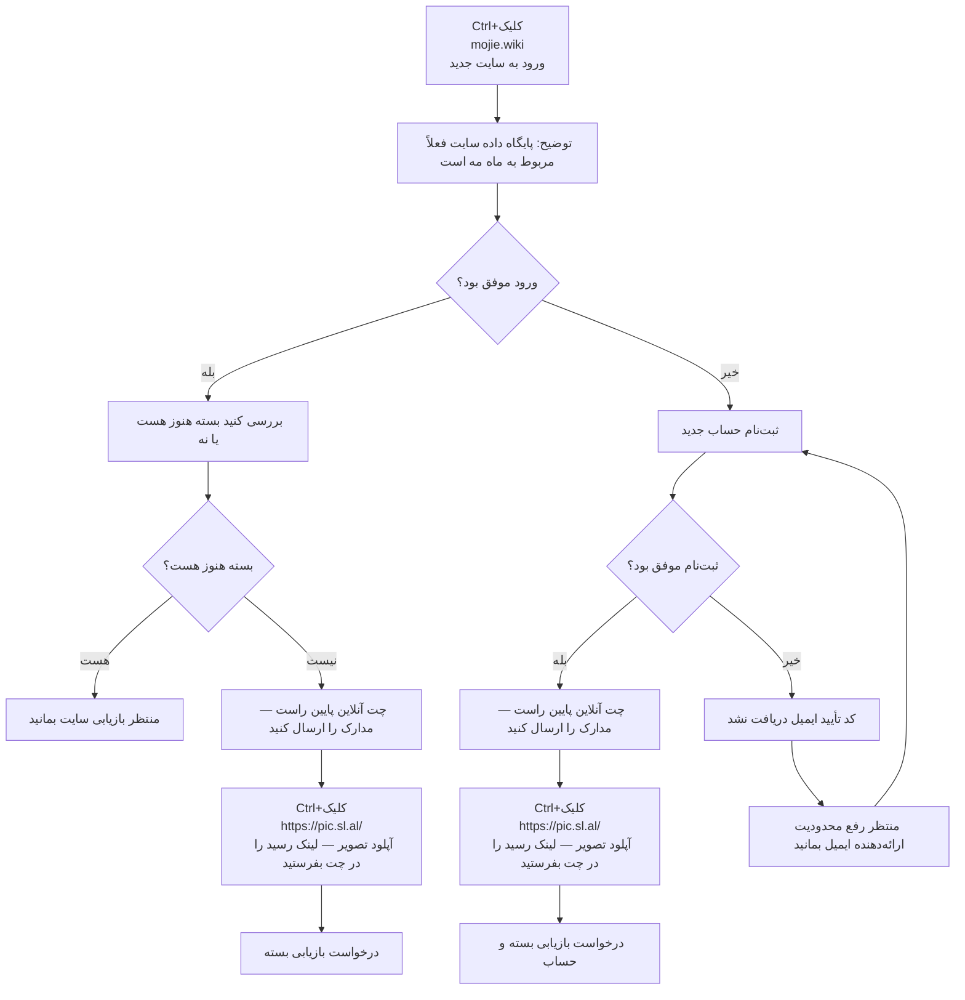

🇨🇳 [中文](README.md) | 🇺🇸 [English](README_EN.md) | 🇷🇺 [Русский](README_RU.md) | 🇮🇷 فارسی

# آدرس‌های رسمی موجی (Mojie / حلقه جادویی) (به‌روزرسانی ۲۵ سپتامبر ۲۰۲۶)

آدرس‌های وب‌سایت رسمی موجی  
آدرس هدایت ۰۱: [www.mojie.wiki](https://www.mojie.wiki)  
جدیدترین آدرس ۰۲: [www.kateyun.org](https://www.kateyun.org)  
آدرس رسمی: [mojie.wiki](https://mojie.wiki)  
آدرس دائمی: [kateyun.org](https://kateyun.org)

پیشنهاد سرویس‌های VPN / پروکسی و اشتراک نود در سال ۲۰۲۶: [https://github.com/modporbme/Global-VPN-SpeedUp](https://github.com/modporbme/Global-VPN-SpeedUp)

## انجمن تلگرام VPN #AD
[گروه قرعه‌کشی](https://t.me/kateyun_org) | [گروه گفتگو](https://t.me/kateyun_org) | [گروه آزمایشی](https://t.me/kateyun_org)

## معرفی
«موجی» یک سرویس حرفه‌ای بهینه‌سازی مسیر شبکه است با ۸۶ ~~نقطه حضور جهانی، از جمله [اینترنت خانگی آمریکا](https://github.com/modporbme/mojie#1%E7%BE%8E%E5%9B%BD)، [اینترنت خانگی هنگ‌کنگ](https://github.com/modporbme/mojie#2%E9%A6%99%E6%B8%AF)، [اینترنت خانگی تایوان](https://github.com/modporbme/mojie#3%E5%8F%B0%E6%B9%BE)، [اینترنت خانگی ژاپن](https://github.com/modporbme/mojie#4%E6%97%A5%E6%9C%AC)، [اینترنت خانگی کره](https://github.com/modporbme/mojie#5%E9%9F%A9%E5%9B%BD) و اینترنت خانگی مالزی~~. هدف آن ارائه شتاب‌دهی پایدار برای کار فرامرزی، جستجوی علمی خارجی و تماشای رسانه است.

## کد دعوت موجی

`کاربرانی که با این کد ثبت‌نام کنند می‌توانند بسته رایگان ۱۰ روز / ۵۰ گیگابایت دریافت کنند`
```bash
QPB5cCmr
```

## کد تخفیف / پرومو موجی
`در حال حاضر معتبر است`
```bash
TRUST20
```
پس از دوره رایگان، کاربران جدید می‌توانند یک‌بار از کد تخفیف روی اولین سفارش سالانه استفاده کنند. قبلاً ~~۱۶۸ یوان در سال~~؛ اکنون XX یوان در سال برای یک سال استفاده.


## بسته‌ها
```

| حجم ترافیک                      | قیمت     | نوع            | پشتیبانی از استریم | بدون محدودیت تعداد کاربران | بدون محدودیت زمانی | بدون محدودیت سرعت | توضیحات                                                                                         |
| ------------------------------- | -------- | -------------- | ------------------ | -------------------------- | ------------------ | ----------------- | ----------------------------------------------------------------------------------------------- |
| ترافیک 130G-بدون محدودیت زمانی  | ¥ 14.90  | پرداخت یک‌باره | پشتیبانی می‌شود    | بله                        | بله                | بله               |                                                                                                 |
| ترافیک 420G-بدون محدودیت زمانی  | ¥ 42.00  | پرداخت یک‌باره | پشتیبانی می‌شود    | بله                        | بله                | بله               |                                                                                                 |
| ترافیک 2G-بدون محدودیت زمانی    | ¥ 1.00   | پرداخت یک‌باره | پشتیبانی می‌شود    | بله                        | بله                | بله               | کاربران ثبت‌نام‌شده با کد دعوت می‌توانند این بسته را با ¥1 تجربه کنند؛ این بسته قابل تمدید نیست |
| ترافیک 750G-بدون محدودیت زمانی  | ¥ 69.00  | پرداخت یک‌باره | پشتیبانی می‌شود    | بله                        | بله                | بله               |                                                                                                 |
| ترافیک 1660G-بدون محدودیت زمانی | ¥ 138.00 | پرداخت یک‌باره | پشتیبانی می‌شود    | بله                        | بله                | بله               |                                                                                                 |
| ترافیک 3600G-بدون محدودیت زمانی | ¥ 279.00 | پرداخت یک‌باره | پشتیبانی می‌شود    | بله                        | بله                | بله               |                                                                                                 |
| ترافیک 10T-بدون محدودیت زمانی   | ¥ 688.00 | پرداخت یک‌باره | پشتیبانی می‌شود    | بله                        | بله                | بله               |                                                                                                 |
```

## مزایا
پوشش جهانی: ۸۶ نقطه POP در سراسر جهان، شامل جنوب‌شرق آسیا، اروپا، آمریکا و برخی مناطق کمیاب.  
مسیر سازمانی: خطوط اختصاصی بین‌المللی Global Accelerator با تضمین SLA بالا در همه نودها.  
پشتیبانی کیفیت فوق‌بالا: بهینه‌سازی برای استریم ۴K/8K رایج با تأخیر بسیار کم.

## 📊 آزمون عملکرد و تحلیل
#### ۱. سرعت در اوج شبانگاهی

#### ۲. گزارش آنلاک استریم

#### ۳. تحلیل خروجی / نقطه فرود

#### ۴. خلوص IP خانگی
##### ۱. آمریکا

##### ۲. هنگ‌کنگ

##### ۳. تایوان

##### ۴. ژاپن

##### ۵. کره


#### ۵. وضعیت سرورها
<details>
<summary><strong>برای مشاهده فهرست سرورها کلیک کنید</strong></summary>

```
| گروه      | نام                                                               | پروتکل   | ضریب       | وضعیت       | بار  |
| --------- | ----------------------------------------------------------------- | -------- | ---------- | ----------- | ---- |
| HK        | 🇭🇰 HKG·هنگ‌کنگ ۰۱ ¹ˣ                                            | TROJAN   | x1.0       | آنلاین      | 11%  |
| HK        | 🇭🇰 HKG·هنگ‌کنگ ۰۲ ¹ˣ                                            | TROJAN   | x1.0       | آنلاین      | 11%  |
| HK        | 🇭🇰 HKG·هنگ‌کنگ ۰۳ ¹ˣ                                            | TROJAN   | x1.0       | آنلاین      | 11%  |
| HK        | 🇭🇰 HKG·هنگ‌کنگ ۰۴ ¹ˣ                                            | TROJAN   | x1.0       | آنلاین      | 11%  |
| HK        | 🇭🇰 HKG·هنگ‌کنگ ۰۵ ¹ˣ                                            | TROJAN   | x1.0       | آنلاین      | 11%  |
| HK        | 🇭🇰 HKG·هنگ‌کنگ ۰۱ ³ˣ                                            | TROJAN   | x3.0       | آنلاین      | 56%  |
| HK        | 🇭🇰 HKG·هنگ‌کنگ ۰۲ ³ˣ                                            | TROJAN   | x3.0       | آنلاین      | 56%  |
| HK        | 🇭🇰 HKG·هنگ‌کنگ ۰۳ ³ˣ                                            | TROJAN   | x3.0       | آنلاین      | 56%  |
| HK        | 🇭🇰 HKG·هنگ‌کنگ ۰۵ ³ˣ                                            | TROJAN   | x3.0       | آنلاین      | 56%  |
| HK        | 🇭🇰 HKG·هنگ‌کنگ ۰۶ ³ˣ                                            | TROJAN   | x3.0       | آنلاین      | 56%  |
| HK        | 🇭🇰 HKG·هنگ‌کنگ ۰۷ ³ˣ                                            | TROJAN   | x3.0       | آنلاین      | 56%  |
| HK        | 🇭🇰 HKG·هنگ‌کنگ ۰۸ ³ˣ                                            | TROJAN   | x3.0       | آنلاین      | 56%  |
| HK        | 🇭🇰 HKG·هنگ‌کنگ ۰۹ ³ˣ                                            | TROJAN   | x3.0       | آنلاین      | 56%  |
| HK        | 🇭🇰 HKG·هنگ‌کنگ ۱۰ ³ˣ                                            | TROJAN   | x3.0       | آنلاین      | 56%  |
| HK        | 🇭🇰 HKG·هنگ‌کنگ ISP-خانگی ³ˣ                                     | TROJAN   | x3.0       | آنلاین      | 56%  |
| US        | 🇺🇸 USA·آمریکا ۰۱ ¹ˣ                                             | TROJAN   | x1.0       | آنلاین      | 11%  |
| US        | 🇺🇸 USA·آمریکا ۰۲ ¹ˣ                                             | TROJAN   | x1.0       | آنلاین      | 11%  |
| US        | 🇺🇸 USA·آمریکا ۰۳ ¹ˣ                                             | TROJAN   | x1.0       | آنلاین      | 11%  |
| US        | 🇺🇸 USA·آمریکا ۰۴ ¹ˣ                                             | TROJAN   | x1.0       | آنلاین      | 11%  |
| US        | 🇺🇸 USA·آمریکا ۰۵ ¹ˣ                                             | TROJAN   | x1.0       | آنلاین      | 11%  |
| US        | 🇺🇸 USA·آمریکا ۰۱ ³ˣ                                             | TROJAN   | x3.0       | آنلاین      | 56%  |
| US        | 🇺🇸 USA·آمریکا ۰۲ ³ˣ                                             | TROJAN   | x3.0       | آنلاین      | 56%  |
| US        | 🇺🇸 USA·آمریکا ۰۳ ³ˣ                                             | TROJAN   | x3.0       | آنلاین      | 56%  |
| US        | 🇺🇸 USA·آمریکا ۰۵ ³ˣ                                             | TROJAN   | x3.0       | آنلاین      | 56%  |
| US        | 🇺🇸 USA·آمریکا ۰۶ ³ˣ                                             | TROJAN   | x3.0       | آنلاین      | 56%  |
| US        | 🇺🇸 USA·آمریکا ۰۷ ³ˣ                                             | TROJAN   | x3.0       | آنلاین      | 56%  |
| US        | 🇺🇸 USA·آمریکا ۰۸ ³ˣ                                             | TROJAN   | x3.0       | آنلاین      | 56%  |
| US        | 🇺🇸 USA·آمریکا ۰۹ ³ˣ                                             | TROJAN   | x3.0       | آنلاین      | 56%  |
| US        | 🇺🇸 USA·آمریکا ۱۰ ³ˣ                                             | TROJAN   | x3.0       | آنلاین      | 56%  |
| US        | 🇺🇸 USA·آمریکا ISP-خانگی ³ˣ                                      | TROJAN   | x3.0       | آنلاین      | 56%  |
| US        | 🇹🇼 TWN·تایوان ۰۲ ³ˣ                                             | TROJAN   | x3.0       | آنلاین      | 56%  |
| TW        | 🇹🇼 TWN·تایوان ۰۱ ¹ˣ                                             | TROJAN   | x1.0       | آنلاین      | 11%  |
| TW        | 🇹🇼 TWN·تایوان ۰۲ ¹ˣ                                             | TROJAN   | x1.0       | آنلاین      | 11%  |
| TW        | 🇹🇼 TWN·تایوان ۰۱ ³ˣ                                             | TROJAN   | x3.0       | آنلاین      | 56%  |
| TW        | 🇹🇼 TWN·تایوان ۰۳ ³ˣ                                             | TROJAN   | x3.0       | آنلاین      | 56%  |
| TW        | 🇹🇼 TWN·تایوان ۰۵ ³ˣ                                             | TROJAN   | x3.0       | آنلاین      | 56%  |
| TW        | 🇹🇼 TWN·تایوان ۰۶ ³ˣ                                             | TROJAN   | x3.0       | آنلاین      | 56%  |
| TW        | 🇹🇼 TWN·تایوان ۰۷ ³ˣ                                             | TROJAN   | x3.0       | آنلاین      | 56%  |
| TW        | 🇹🇼 TWN·تایوان ۰۸ ³ˣ                                             | TROJAN   | x3.0       | آنلاین      | 56%  |
| TW        | 🇹🇼 TWN·تایوان ISP-خانگی ³ˣ                                      | TROJAN   | x3.0       | آنلاین      | 56%  |
| SG        | 🇸🇬 SGP·سنگاپور ۰۱ ¹ˣ                                            | TROJAN   | x1.0       | آنلاین      | 11%  |
| SG        | 🇸🇬 SGP·سنگاپور ۰۲ ¹ˣ                                            | TROJAN   | x1.0       | آنلاین      | 11%  |
| SG        | 🇸🇬 SGP·سنگاپور ۰۱ ³ˣ                                            | TROJAN   | x3.0       | آنلاین      | 56%  |
| SG        | 🇸🇬 SGP·سنگاپور ۰۲ ³ˣ                                            | TROJAN   | x3.0       | آنلاین      | 56%  |
| SG        | 🇸🇬 SGP·سنگاپور ۰۳ ³ˣ                                            | TROJAN   | x3.0       | آنلاین      | 56%  |
| SG        | 🇸🇬 SGP·سنگاپور ۰۵ ³ˣ                                            | TROJAN   | x3.0       | آنلاین      | 56%  |
| SG        | 🇸🇬 SGP·سنگاپور ۰۶ ³ˣ                                            | TROJAN   | x3.0       | آنلاین      | 56%  |
| JP        | 🇯🇵 JPN·ژاپن ۰۱ ¹ˣ                                               | TROJAN   | x1.0       | آنلاین      | 11%  |
| JP        | 🇯🇵 JPN·ژاپن ۰۲ ¹ˣ                                               | TROJAN   | x1.0       | آنلاین      | 11%  |
| JP        | 🇯🇵 JPN·ژاپن ۰۱ ³ˣ                                               | TROJAN   | x3.0       | آنلاین      | 56%  |
| JP        | 🇯🇵 JPN·ژاپن ۰۲ ³ˣ                                               | TROJAN   | x3.0       | آنلاین      | 56%  |
| JP        | 🇯🇵 JPN·ژاپن ۰۳ ³ˣ                                               | TROJAN   | x3.0       | آنلاین      | 56%  |
| JP        | 🇯🇵 JPN·ژاپن ۰۵ ³ˣ                                               | TROJAN   | x3.0       | آنلاین      | 56%  |
| JP        | 🇯🇵 JPN·ژاپن ۰۶ ³ˣ                                               | TROJAN   | x3.0       | آنلاین      | 56%  |
| JP        | 🇯🇵 JPN·ژاپن ISP-خانگی ³ˣ                                        | TROJAN   | x3.0       | آنلاین      | 56%  |
| KR        | 🇰🇷 KOR·کره ۰۱ ¹ˣ                                                | TROJAN   | x1.0       | آنلاین      | 11%  |
| KR        | 🇰🇷 KOR·کره ۰۲ ¹ˣ                                                | TROJAN   | x1.0       | آنلاین      | 11%  |
| KR        | 🇰🇷 KOR·کره ۰۱ ³ˣ                                                | TROJAN   | x3.0       | آنلاین      | 56%  |
| KR        | 🇰🇷 KOR·کره ۰۲ ³ˣ                                                | TROJAN   | x3.0       | آنلاین      | 56%  |
| KR        | 🇰🇷 KOR·کره ۰۳ ³ˣ                                                | TROJAN   | x3.0       | آنلاین      | 56%  |
| KR        | 🇰🇷 KOR·کره ۰۵ ³ˣ                                                | TROJAN   | x3.0       | آنلاین      | 56%  |
| KR        | 🇰🇷 KOR·کره ۰۶ ³ˣ                                                | TROJAN   | x3.0       | آنلاین      | 56%  |
| KR        | 🇰🇷 KOR·کره ISP-خانگی ³ˣ                                         | TROJAN   | x3.0       | آنلاین      | 56%  |
| TH        | 🇹🇭 THA·تایلند ۰۱ ³ˣ                                             | TROJAN   | x3.0       | آنلاین      | 56%  |
| TH        | 🇹🇭 THA·تایلند ۰۲ ³ˣ                                             | TROJAN   | x3.0       | آنلاین      | 56%  |
| TH        | 🇹🇭 THA·تایلند ۰۳ ³ˣ                                             | TROJAN   | x3.0       | آنلاین      | 56%  |
| MY        | 🇲🇾 MYS·مالزی ۰۱ ³ˣ                                              | TROJAN   | x3.0       | آنلاین      | 56%  |
| MY        | 🇲🇾 MYS·مالزی ISP-خانگی ³ˣ                                       | TROJAN   | x3.0       | آنلاین      | 56%  |
| VN        | 🇻🇳 VNM·ویتنام ۰۱ ³ˣ                                             | TROJAN   | x3.0       | آنلاین      | 56%  |
| PH        | 🇵🇭 PHL·فیلیپین ۰۱ ³ˣ                                            | TROJAN   | x3.0       | آنلاین      | 56%  |
| ID        | 🇮🇩 IDN·اندونزی ۰۱ ³ˣ                                            | TROJAN   | x3.0       | آنلاین      | 56%  |
| TR        | 🇹🇷 TUR·ترکیه ۰۱ ³ˣ                                              | TROJAN   | x3.0       | آنلاین      | 56%  |
| TR        | 🇹🇷 TUR·ترکیه ۰۲ ³ˣ                                              | TROJAN   | x3.0       | آنلاین      | 56%  |
| TR        | 🇹🇷 TUR·ترکیه ۰۳ ³ˣ                                              | TROJAN   | x3.0       | آنلاین      | 56%  |
| GB        | 🇬🇧 GBR·بریتانیا ۰۱ ³ˣ                                           | TROJAN   | x3.0       | آنلاین      | 56%  |
| GB        | 🇬🇧 GBR·بریتانیا ۰۲ ³ˣ                                           | TROJAN   | x3.0       | آنلاین      | 56%  |
| GB        | 🇬🇧 GBR·بریتانیا ۰۳ ³ˣ                                           | TROJAN   | x3.0       | آنلاین      | 56%  |
| DE        | 🇩🇪 DEU·آلمان ۰۱ ³ˣ                                              | TROJAN   | x3.0       | آنلاین      | 56%  |
| FR        | 🇫🇷 FRA·فرانسه ۰۱ ³ˣ                                             | TROJAN   | x3.0       | آنلاین      | 56%  |
| BR        | 🇧🇷 BRA·برزیل ۰۱ ³ˣ                                              | TROJAN   | x3.0       | آنلاین      | 56%  |
| AE        | 🇦🇪 ARE·امارات ۰۱ ³ˣ                                             | TROJAN   | x3.0       | آنلاین      | 56%  |
| بدون گروه | 🇨🇳 در صورت از کار افتادن نود، اشتراک را به‌روز کنید            | VMESS    | x3.0       | در حال نگهداری | —    |
| بدون گروه | 🇨🇳 آدرس دائمی: [WWW.MOJIE.WIKI](https://github.com/modporbme/mojie) | VMESS | x3.0 | در حال نگهداری | — |
| بدون گروه | 🇨🇳 دسترسی از سرزمین اصلی چین: v13.v2ny.me                       | VMESS    | x3.0       | در حال نگهداری | —    |
| بدون گروه | 🇨🇳 [رسمی] گروه تلگرام در پایین                                  | VMESS    | x3.0       | در حال نگهداری | —    |
| بدون گروه | 🇨🇳 خوش آمدید 👉 @V2NAIUN 👈                                      | VMESS    | x3.0       | در حال نگهداری | —    |
```

</details>

## بازیابی
### آموزش بازیابی حساب / بسته
`متن زیر را کپی کنید و برای پشتیبانی بفرستید. اطلاعات را یک‌جا کامل بدهید تا سریع‌تر رسیدگی شود.`  
`تیکت جدید باز نکنید.`
```bash
نوع مشکل: (سفارش گم‌شده / شارژ واریز نشده / مشکل بسته)
حساب:
(ایمیل ثبت‌نام یا نام کاربری)
نام بسته:
زمان خرید / تمدید:
(تاریخ و ساعت دقیق را بنویسید)
مبلغ سفارش:
روش پرداخت:
(مثلاً Alipay، WeChat)
شرح مشکل:
(مشکل و زمان وقوع را توضیح دهید)
پیوست:
اسکرین‌شات رسید پرداخت
```


