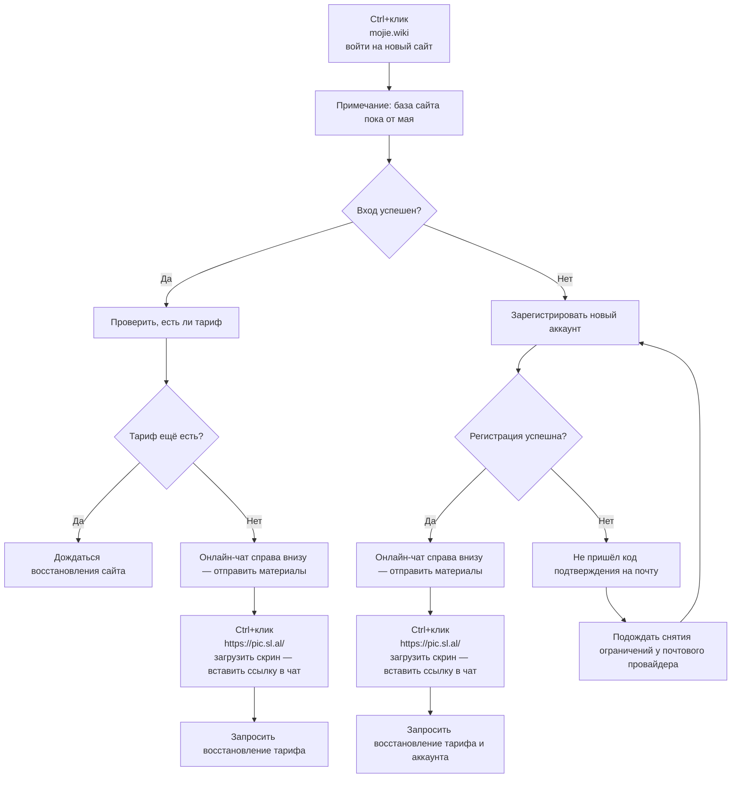

🇨🇳 [中文](README.md) | 🇺🇸 [English](README_EN.md) | 🇷🇺 Русский | 🇮🇷 [فارسی](README_FA.md)

# Официальные адреса Mojie (Magic Ring) (обновлено 17 сентября 2026)

Официальные адреса сайта Mojie  
Адрес перенаправления 01: [www.mojie.wiki](https://www.mojie.wiki)  
Актуальный адрес 02: [www.kateyun.org](https://www.kateyun.org)  
Официальный адрес: [mojie.wiki](https://mojie.wiki)  
Постоянный адрес: [kateyun.org](https://kateyun.org)

Рекомендации VPN / прокси и раздача узлов на 2026 год: [https://github.com/modporbme/Global-VPN-SpeedUp](https://github.com/modporbme/Global-VPN-SpeedUp)

## Telegram-сообщество VPN #AD
[Группа розыгрышей](https://t.me/kateyun_org) | [Чат](https://t.me/kateyun_org) | [Пробная группа](https://t.me/kateyun_org)

## Описание
«Mojie» — профессиональный сервис оптимизации сетевых маршрутов с 86 ~~точками присутствия по всему миру, включая [домашние каналы США](https://github.com/modporbme/mojie#1%E7%BE%8E%E5%9B%BD), [домашние каналы Гонконга](https://github.com/modporbme/mojie#2%E9%A6%99%E6%B8%AF), [домашние каналы Тайваня](https://github.com/modporbme/mojie#3%E5%8F%B0%E6%B9%BE), [домашние каналы Японии](https://github.com/modporbme/mojie#4%E6%97%A5%E6%9C%AC), [домашние каналы Кореи](https://github.com/modporbme/mojie#5%E9%9F%A9%E5%9B%BD) и домашние каналы Малайзии~~. Сервис предназначен для стабильного ускорения при удалённой работе, зарубежных академических поисках и просмотре медиа.

## Пригласительный код Mojie


`Пользователи, зарегистрировавшиеся по этому коду, могут получить бесплатный тариф на 10 дней / 50 ГБ`
```bash
QPB5cCmr
```

## Скидочный / промокод Mojie
`Действует`
```bash
TRUST20
```
После бесплатного периода новые пользователи могут один раз использовать промокод на первый годовой заказ. Было ~~¥168/год~~; сейчас XX юаней/год за год использования.


## Тарифы
```
| Объём трафика                            | Цена     | Тип         | Поддержка стриминга | Без ограничения числа пользователей | Без ограничения по времени | Без ограничения скорости | Примечание                                                                                                      |
| ---------------------------------------- | -------- | ----------- | ------------------- | ----------------------------------- | -------------------------- | ------------------------ | --------------------------------------------------------------------------------------------------------------- |
| 130G трафика-без ограничения по времени  | ¥ 14.90  | Единоразово | Поддерживается      | Да                                  | Да                         | Да                       |                                                                                                                 |
| 420G трафика-без ограничения по времени  | ¥ 42.00  | Единоразово | Поддерживается      | Да                                  | Да                         | Да                       |                                                                                                                 |
| 2G трафика-без ограничения по времени    | ¥ 1.00   | Единоразово | Поддерживается      | Да                                  | Да                         | Да                       | Пользователи, зарегистрированные с кодом приглашения, могут попробовать пакет за ¥1; этот пакет нельзя продлить |
| 750G трафика-без ограничения по времени  | ¥ 69.00  | Единоразово | Поддерживается      | Да                                  | Да                         | Да                       |                                                                                                                 |
| 1660G трафика-без ограничения по времени | ¥ 138.00 | Единоразово | Поддерживается      | Да                                  | Да                         | Да                       |                                                                                                                 |
| 3600G трафика-без ограничения по времени | ¥ 279.00 | Единоразово | Поддерживается      | Да                                  | Да                         | Да                       |                                                                                                                 |
| 10T трафика-без ограничения по времени   | ¥ 688.00 | Единоразово | Поддерживается      | Да                                  | Да                         | Да                       |                                                                                                                 |
```

## Преимущества
Глобальное покрытие: 86 точек POP по всему миру — Юго-Восточная Азия, Европа, США и ряд редких регионов.  
Корпоративные каналы: международные выделенные линии Global Accelerator, высокая доступность SLA на всех узлах.  
Поддержка сверхвысокого разрешения: оптимизация для популярных 4K/8K-стримов с очень низкой задержкой.

## 📊 Тесты производительности и анализ
#### 1. Скорость в вечерний пик

#### 2. Отчёт о разблокировке стриминга

#### 3. Анализ выходных / посадочных узлов

#### 4. «Чистота» домашних IP
##### 1. США

##### 2. Гонконг

##### 3. Тайвань

##### 4. Япония

##### 5. Корея


#### 5. Состояние серверов
<details>
<summary><strong>Нажмите, чтобы раскрыть список серверов</strong></summary>

```
| Группа    | Название                                                          | Протокол | Множитель  | Статус      | Нагрузка |
| --------- | ----------------------------------------------------------------- | -------- | ---------- | ----------- | -------- |
| HK        | 🇭🇰 HKG·Гонконг 01 ¹ˣ                                            | TROJAN   | x1.0       | Онлайн      | 11%      |
| HK        | 🇭🇰 HKG·Гонконг 02 ¹ˣ                                            | TROJAN   | x1.0       | Онлайн      | 11%      |
| HK        | 🇭🇰 HKG·Гонконг 03 ¹ˣ                                            | TROJAN   | x1.0       | Онлайн      | 11%      |
| HK        | 🇭🇰 HKG·Гонконг 04 ¹ˣ                                            | TROJAN   | x1.0       | Онлайн      | 11%      |
| HK        | 🇭🇰 HKG·Гонконг 05 ¹ˣ                                            | TROJAN   | x1.0       | Онлайн      | 11%      |
| HK        | 🇭🇰 HKG·Гонконг 01 ³ˣ                                            | TROJAN   | x3.0       | Онлайн      | 56%      |
| HK        | 🇭🇰 HKG·Гонконг 02 ³ˣ                                            | TROJAN   | x3.0       | Онлайн      | 56%      |
| HK        | 🇭🇰 HKG·Гонконг 03 ³ˣ                                            | TROJAN   | x3.0       | Онлайн      | 56%      |
| HK        | 🇭🇰 HKG·Гонконг 05 ³ˣ                                            | TROJAN   | x3.0       | Онлайн      | 56%      |
| HK        | 🇭🇰 HKG·Гонконг 06 ³ˣ                                            | TROJAN   | x3.0       | Онлайн      | 56%      |
| HK        | 🇭🇰 HKG·Гонконг 07 ³ˣ                                            | TROJAN   | x3.0       | Онлайн      | 56%      |
| HK        | 🇭🇰 HKG·Гонконг 08 ³ˣ                                            | TROJAN   | x3.0       | Онлайн      | 56%      |
| HK        | 🇭🇰 HKG·Гонконг 09 ³ˣ                                            | TROJAN   | x3.0       | Онлайн      | 56%      |
| HK        | 🇭🇰 HKG·Гонконг 10 ³ˣ                                            | TROJAN   | x3.0       | Онлайн      | 56%      |
| HK        | 🇭🇰 HKG·Гонконг ISP-домашний ³ˣ                                  | TROJAN   | x3.0       | Онлайн      | 56%      |
| US        | 🇺🇸 USA·США 01 ¹ˣ                                                | TROJAN   | x1.0       | Онлайн      | 11%      |
| US        | 🇺🇸 USA·США 02 ¹ˣ                                                | TROJAN   | x1.0       | Онлайн      | 11%      |
| US        | 🇺🇸 USA·США 03 ¹ˣ                                                | TROJAN   | x1.0       | Онлайн      | 11%      |
| US        | 🇺🇸 USA·США 04 ¹ˣ                                                | TROJAN   | x1.0       | Онлайн      | 11%      |
| US        | 🇺🇸 USA·США 05 ¹ˣ                                                | TROJAN   | x1.0       | Онлайн      | 11%      |
| US        | 🇺🇸 USA·США 01 ³ˣ                                                | TROJAN   | x3.0       | Онлайн      | 56%      |
| US        | 🇺🇸 USA·США 02 ³ˣ                                                | TROJAN   | x3.0       | Онлайн      | 56%      |
| US        | 🇺🇸 USA·США 03 ³ˣ                                                | TROJAN   | x3.0       | Онлайн      | 56%      |
| US        | 🇺🇸 USA·США 05 ³ˣ                                                | TROJAN   | x3.0       | Онлайн      | 56%      |
| US        | 🇺🇸 USA·США 06 ³ˣ                                                | TROJAN   | x3.0       | Онлайн      | 56%      |
| US        | 🇺🇸 USA·США 07 ³ˣ                                                | TROJAN   | x3.0       | Онлайн      | 56%      |
| US        | 🇺🇸 USA·США 08 ³ˣ                                                | TROJAN   | x3.0       | Онлайн      | 56%      |
| US        | 🇺🇸 USA·США 09 ³ˣ                                                | TROJAN   | x3.0       | Онлайн      | 56%      |
| US        | 🇺🇸 USA·США 10 ³ˣ                                                | TROJAN   | x3.0       | Онлайн      | 56%      |
| US        | 🇺🇸 USA·США ISP-домашний ³ˣ                                      | TROJAN   | x3.0       | Онлайн      | 56%      |
| US        | 🇹🇼 TWN·Тайвань 02 ³ˣ                                            | TROJAN   | x3.0       | Онлайн      | 56%      |
| TW        | 🇹🇼 TWN·Тайвань 01 ¹ˣ                                            | TROJAN   | x1.0       | Онлайн      | 11%      |
| TW        | 🇹🇼 TWN·Тайвань 02 ¹ˣ                                            | TROJAN   | x1.0       | Онлайн      | 11%      |
| TW        | 🇹🇼 TWN·Тайвань 01 ³ˣ                                            | TROJAN   | x3.0       | Онлайн      | 56%      |
| TW        | 🇹🇼 TWN·Тайвань 03 ³ˣ                                            | TROJAN   | x3.0       | Онлайн      | 56%      |
| TW        | 🇹🇼 TWN·Тайвань 05 ³ˣ                                            | TROJAN   | x3.0       | Онлайн      | 56%      |
| TW        | 🇹🇼 TWN·Тайвань 06 ³ˣ                                            | TROJAN   | x3.0       | Онлайн      | 56%      |
| TW        | 🇹🇼 TWN·Тайвань 07 ³ˣ                                            | TROJAN   | x3.0       | Онлайн      | 56%      |
| TW        | 🇹🇼 TWN·Тайвань 08 ³ˣ                                            | TROJAN   | x3.0       | Онлайн      | 56%      |
| TW        | 🇹🇼 TWN·Тайвань ISP-домашний ³ˣ                                  | TROJAN   | x3.0       | Онлайн      | 56%      |
| SG        | 🇸🇬 SGP·Сингапур 01 ¹ˣ                                           | TROJAN   | x1.0       | Онлайн      | 11%      |
| SG        | 🇸🇬 SGP·Сингапур 02 ¹ˣ                                           | TROJAN   | x1.0       | Онлайн      | 11%      |
| SG        | 🇸🇬 SGP·Сингапур 01 ³ˣ                                           | TROJAN   | x3.0       | Онлайн      | 56%      |
| SG        | 🇸🇬 SGP·Сингапур 02 ³ˣ                                           | TROJAN   | x3.0       | Онлайн      | 56%      |
| SG        | 🇸🇬 SGP·Сингапур 03 ³ˣ                                           | TROJAN   | x3.0       | Онлайн      | 56%      |
| SG        | 🇸🇬 SGP·Сингапур 05 ³ˣ                                           | TROJAN   | x3.0       | Онлайн      | 56%      |
| SG        | 🇸🇬 SGP·Сингапур 06 ³ˣ                                           | TROJAN   | x3.0       | Онлайн      | 56%      |
| JP        | 🇯🇵 JPN·Япония 01 ¹ˣ                                             | TROJAN   | x1.0       | Онлайн      | 11%      |
| JP        | 🇯🇵 JPN·Япония 02 ¹ˣ                                             | TROJAN   | x1.0       | Онлайн      | 11%      |
| JP        | 🇯🇵 JPN·Япония 01 ³ˣ                                             | TROJAN   | x3.0       | Онлайн      | 56%      |
| JP        | 🇯🇵 JPN·Япония 02 ³ˣ                                             | TROJAN   | x3.0       | Онлайн      | 56%      |
| JP        | 🇯🇵 JPN·Япония 03 ³ˣ                                             | TROJAN   | x3.0       | Онлайн      | 56%      |
| JP        | 🇯🇵 JPN·Япония 05 ³ˣ                                             | TROJAN   | x3.0       | Онлайн      | 56%      |
| JP        | 🇯🇵 JPN·Япония 06 ³ˣ                                             | TROJAN   | x3.0       | Онлайн      | 56%      |
| JP        | 🇯🇵 JPN·Япония ISP-домашний ³ˣ                                   | TROJAN   | x3.0       | Онлайн      | 56%      |
| KR        | 🇰🇷 KOR·Корея 01 ¹ˣ                                              | TROJAN   | x1.0       | Онлайн      | 11%      |
| KR        | 🇰🇷 KOR·Корея 02 ¹ˣ                                              | TROJAN   | x1.0       | Онлайн      | 11%      |
| KR        | 🇰🇷 KOR·Корея 01 ³ˣ                                              | TROJAN   | x3.0       | Онлайн      | 56%      |
| KR        | 🇰🇷 KOR·Корея 02 ³ˣ                                              | TROJAN   | x3.0       | Онлайн      | 56%      |
| KR        | 🇰🇷 KOR·Корея 03 ³ˣ                                              | TROJAN   | x3.0       | Онлайн      | 56%      |
| KR        | 🇰🇷 KOR·Корея 05 ³ˣ                                              | TROJAN   | x3.0       | Онлайн      | 56%      |
| KR        | 🇰🇷 KOR·Корея 06 ³ˣ                                              | TROJAN   | x3.0       | Онлайн      | 56%      |
| KR        | 🇰🇷 KOR·Корея ISP-домашний ³ˣ                                    | TROJAN   | x3.0       | Онлайн      | 56%      |
| TH        | 🇹🇭 THA·Таиланд 01 ³ˣ                                            | TROJAN   | x3.0       | Онлайн      | 56%      |
| TH        | 🇹🇭 THA·Таиланд 02 ³ˣ                                            | TROJAN   | x3.0       | Онлайн      | 56%      |
| TH        | 🇹🇭 THA·Таиланд 03 ³ˣ                                            | TROJAN   | x3.0       | Онлайн      | 56%      |
| MY        | 🇲🇾 MYS·Малайзия 01 ³ˣ                                           | TROJAN   | x3.0       | Онлайн      | 56%      |
| MY        | 🇲🇾 MYS·Малайзия ISP-домашний ³ˣ                                 | TROJAN   | x3.0       | Онлайн      | 56%      |
| VN        | 🇻🇳 VNM·Вьетнам 01 ³ˣ                                            | TROJAN   | x3.0       | Онлайн      | 56%      |
| PH        | 🇵🇭 PHL·Филиппины 01 ³ˣ                                          | TROJAN   | x3.0       | Онлайн      | 56%      |
| ID        | 🇮🇩 IDN·Индонезия 01 ³ˣ                                          | TROJAN   | x3.0       | Онлайн      | 56%      |
| TR        | 🇹🇷 TUR·Турция 01 ³ˣ                                             | TROJAN   | x3.0       | Онлайн      | 56%      |
| TR        | 🇹🇷 TUR·Турция 02 ³ˣ                                             | TROJAN   | x3.0       | Онлайн      | 56%      |
| TR        | 🇹🇷 TUR·Турция 03 ³ˣ                                             | TROJAN   | x3.0       | Онлайн      | 56%      |
| GB        | 🇬🇧 GBR·Великобритания 01 ³ˣ                                     | TROJAN   | x3.0       | Онлайн      | 56%      |
| GB        | 🇬🇧 GBR·Великобритания 02 ³ˣ                                     | TROJAN   | x3.0       | Онлайн      | 56%      |
| GB        | 🇬🇧 GBR·Великобритания 03 ³ˣ                                     | TROJAN   | x3.0       | Онлайн      | 56%      |
| DE        | 🇩🇪 DEU·Германия 01 ³ˣ                                           | TROJAN   | x3.0       | Онлайн      | 56%      |
| FR        | 🇫🇷 FRA·Франция 01 ³ˣ                                            | TROJAN   | x3.0       | Онлайн      | 56%      |
| BR        | 🇧🇷 BRA·Бразилия 01 ³ˣ                                           | TROJAN   | x3.0       | Онлайн      | 56%      |
| AE        | 🇦🇪 ARE·ОАЭ 01 ³ˣ                                                | TROJAN   | x3.0       | Онлайн      | 56%      |
| Без группы| 🇨🇳 Если узел недоступен, обновите подписку                      | VMESS    | x3.0       | Обслуживание| —        |
| Без группы| 🇨🇳 Постоянный адрес: [WWW.MOJIE.WIKI](https://github.com/modporbme/mojie) | VMESS | x3.0 | Обслуживание | — |
| Без группы| 🇨🇳 Доступ из материкового Китая: v13.v2ny.me                    | VMESS    | x3.0       | Обслуживание| —        |
| Без группы| 🇨🇳 [Официально] Telegram-группа ниже                            | VMESS    | x3.0       | Обслуживание| —        |
| Без группы| 🇨🇳 Добро пожаловать 👉 @V2NAIUN 👈                               | VMESS    | x3.0       | Обслуживание| —        |
```

</details>

## Восстановление
### Как восстановить аккаунт / тариф
`Скопируйте текст ниже и отправьте в поддержку. Укажите все данные сразу, чтобы заявку обработали быстрее.`  
`Не создавайте новое обращение.`
```bash
Тип проблемы: (пропал заказ / платёж не зачислен / проблема с тарифом)
Аккаунт:
(email регистрации или имя пользователя)
Название тарифа:
Время покупки / продления:
(укажите точную дату и время)
Сумма заказа:
Способ оплаты:
(например, Alipay, WeChat)
Описание проблемы:
(опишите проблему и когда она возникла)
Вложения:
скриншот квитанции об оплате
```


